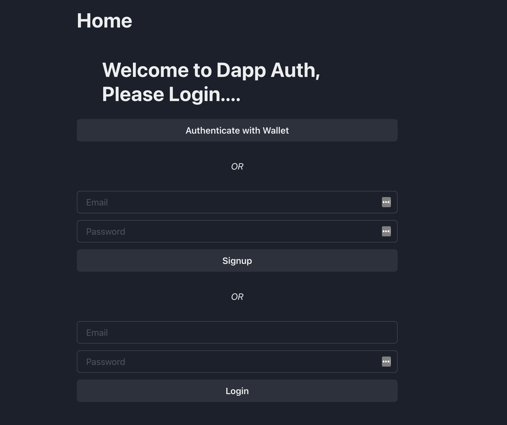

# DAPP Authentication

<br/>
<p align="center">
<a href="https://chain.link" target="_blank">

</a>
</p>
<br/>


## Summary 
Dapp authentication is an authentication application built with reactjs. It allows you to:

- `Create an account using your blockchain wallet`: it currently only supports metamask
- `Create an account using a form `
- ` Edit your profile`
- `Login into your decentralized application using your wallet`

and more

## Getting Started

To run this locally:

1. Install [nodejs and npm](https://nodejs.org/en/download/)

2. Clone this repo
3. Run 
```
npm install 
```
to install packages

4. Set your environment variables. You can obtain them [here](https://moralis.io/)


# License

This project is licensed under the [MIT license](LICENSE).